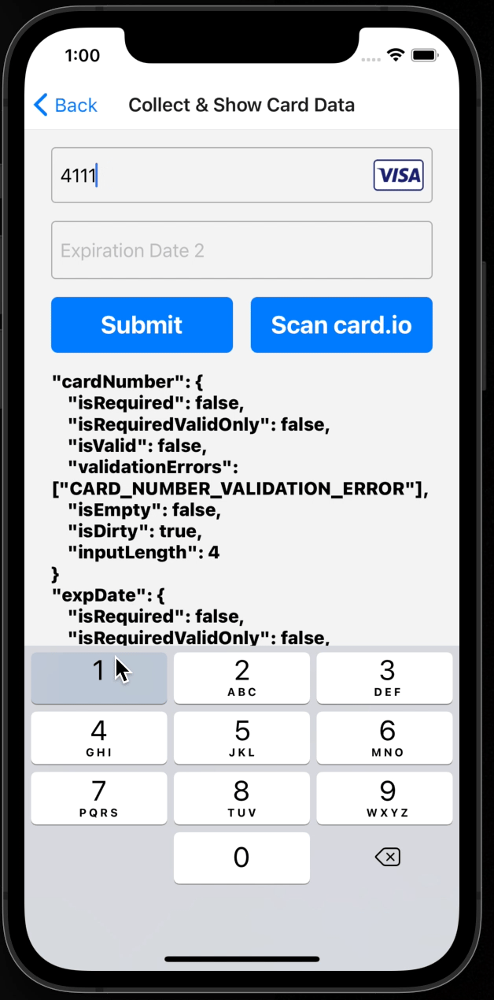
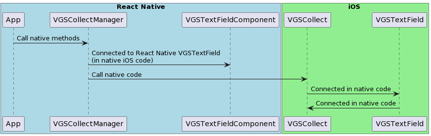
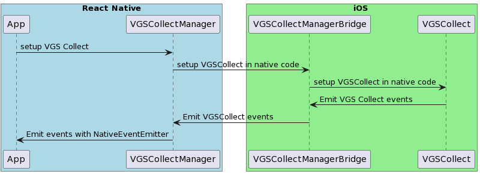
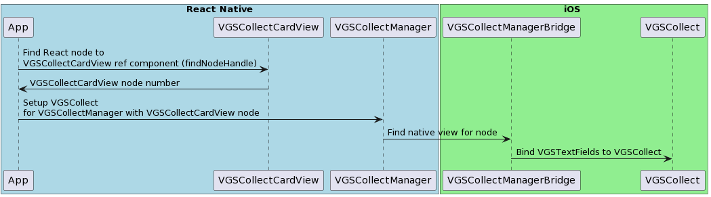

## VGS Collect/Show SDKs - React Native Demo

> **_NOTE:_** This demo is just an example of how VGS Collect [iOS SDK](https://github.com/verygoodsecurity/vgs-collect-ios) & [Android SDK](https://github.com/verygoodsecurity/vgs-collect-android)
> and VGS Show [iOS SDK](https://github.com/verygoodsecurity/vgs-show-ios) & [Android SDK](https://github.com/verygoodsecurity/vgs-show-android) can be integrated into your RN application. We do not have official RN packages.

## How to run it?

### Requirements

- Installed latest <a href="https://apps.apple.com/us/app/xcode/id497799835?mt=12" target="_blank">Xcode</a>
- Installed latest <a href="https://developer.android.com/studio" target="_blank">Android Studio</a>
- Installed <a href="https://guides.cocoapods.org/using/getting-started.html#installation" target="_blank">CocoaPods</a>
- Organization with <a href="https://www.verygoodsecurity.com/">VGS</a>

> **_NOTE:_** This demo is build with Xcode 13.4. Check open Xcode-React Native issues [here](https://github.com/facebook/react-native/issues/31480).

#### Step 1

Go to your <a href="https://dashboard.verygoodsecurity.com/" target="_blank">VGS organization</a> and establish <a href="https://www.verygoodsecurity.com/docs/getting-started/quick-integration#securing-inbound-connection" target="_blank">Inbound connection</a>. For this demo you can import pre-built route configuration:

- Find the **configuration.yaml** file inside the app repository and download it.
- Go to the **Routes** section on the <a href="https://dashboard.verygoodsecurity.com/" target="_blank">Dashboard</a> page and select the **Inbound** tab.
- Press **Manage** button at the right corner and select **Import YAML file**.
- Choose **configuration.yaml** file that you just downloaded and tap on **Save** button to save the route.

#### Step 2

Clone the application repository.

#### Step 3

Install npm:

`npm install`

Open Terminal and change working directory to `ios` folder that is inside:

`cd ~/vgs-collect-show-ios-react-native-demo/ios`

Install pods:

`pod install`

#### Step 4

**iOS**: In `vgs-collect-show-ios-react-native-demo` folder find and open `AwesomeProject.xcworkspace` file.
In the app go to `VGSCollectManager.swift` file, find `SharedConfig` class and `vaultId` attribute there:

`let vaultId = "vaultId"`

and replace `vaultId` with your organization
<a href="https://www.verygoodsecurity.com/docs/terminology/nomenclature#vault" target="_blank">vault id</a>.

**Android**: Setup `"<VAULT_ID>"`.

For VGS Collect Android SDK, find [VGSCollectModule.java](https://github.com/vgs-samples/vgs-collect-show-react-native-demo/blob/master/android/app/src/main/java/com/collectrndemo/modules/collect/VGSCollectModule.java#L27) and replace `<VAULT_ID>` constant with your <a href="https://www.verygoodsecurity.com/docs/terminology/nomenclature#vault" target="_blank">vault id</a>.

For VGS Show Android SDK, find [VGSShowModule.java](https://github.com/vgs-samples/vgs-collect-show-react-native-demo/blob/master/android/app/src/main/java/com/collectrndemo/modules/show/VGSShowModule.java#L26) and replace `<VAULT_ID>` constant with your <a href="https://www.verygoodsecurity.com/docs/terminology/nomenclature#vault" target="_blank">vault id</a>.

### Step 5

Run the application and submit the form.
Then go to the Logs tab on <a href="http://dashboard.verygoodsecurity.com" target="_blank">Dashboard</a>, find request and secure a payload.
Instruction for this step you can find <a href="https://www.verygoodsecurity.com/docs/getting-started/quick-integration#securing-inbound-connection" target="_blank">here</a>.

## How it works?

The application provides you an example of how to integrate VGS Collect and Show SDKs into React Native via bridges. It also shows you an example of how to integrate with CardIO and collect card data securely.

There are two main types of integration: simple and andvanced approach. `VGSCollect` and `VGSShow` integration consists of 2 main parts:

1. Creating and styling UI components: `VGSTextField` & `VGSLabel`.
2. Setup `VGSCollect` & `VGSShow` instance and binding them to proper UI components to `VGSTextField` & `VGSLabel`.

How to bind `VGSCollect` & `VGSShow` to UI textFields and labels defines approach.

### Simple approach

Simple approach is based on binding `VGSCollect` textfield inputs to `VGSCollect` in native platform code iOS and Android.
Each `VGSTextField` can be bound to shared `VGSCollect` instance (singleton) in native code on creation.
This approach doesn't require complicated interaction with React Native since all setup is going on in native platform code.

The same adheres to `VGSShow`.

### Advanced approach

Advanced approach is based on binding `VGSCollect` textfields to `VGSCollect` instance in React Native code.
It requires more code and more interactions with React Native, it can provide more flexibility if you need it (like setup VGSCollect from React Native code).

1. Create native view `VGSCollectCardView` subclass of `UIView` holding
   `VGSTextFields`. Keeping multiple `VGSTextFields` in single view is not required, however it may mitigate handling additional actions.
2. Create React Native bridge class returning view subclass. `VGSCollectCardViewManager` in iOS and in Android.
3. Create `VGSCollectManager` React Native bridge class holding `VGSCollect` instance with proper methods.
4. Import native module for `VGSCollectCardView`, add `VGSCollectCardView` to your component tree.
5. Import native module for `VGSCollectManager`.
6. Setup `VGSCollectManager` once in `useEffect([])`, set your `vaultId` and `environment`.
7. Create ref for `VGSCollectCardView`, register `useEffect` hook for this ref.
   You should not use `useRef` hook for this since `VGSCollectCardView` is not pure React component.
8. When `ref` is avaiable use `findNodeHandle` to find React node for this view.
   Then pass `node number` to native code with `VGSCollectManager` and find native view corresponding to this node. Bind `VGSCollect` with proper `VGSTextFields`.

### Useful links

- <a href="https://www.verygoodsecurity.com/docs/vgs-collect/" target="_blank">VGS Collect SDK Documentation</a>
- <a href="https://www.verygoodsecurity.com/docs/vgs-show/" target="_blank">VGS Show SDK Documentation</a>
- <a href="https://github.com/verygoodsecurity/vgs-collect-ios" target="_blank">VGS Collect iOS SDK source code on GH</a>
- <a href="https://github.com/verygoodsecurity/vgs-collect-android" target="_blank">VGS Collect Android SDK source code on GH</a>
- <a href="https://github.com/verygoodsecurity/vgs-show-ios" target="_blank">VGS Show iOS SDK source code on GH</a>
- <a href="https://github.com/verygoodsecurity/vgs-show-android" target="_blank">VGS Show Android SDK source code on GH</a>
- <a href="https://facebook.github.io/react-native/docs/native-modules-ios#exporting-swift" target="_blank">Exporting Swift into React Native</a>
